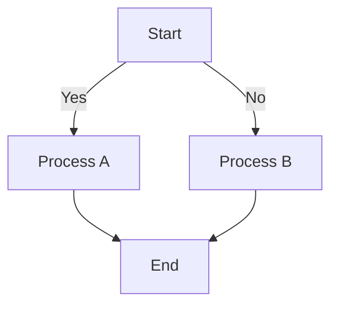
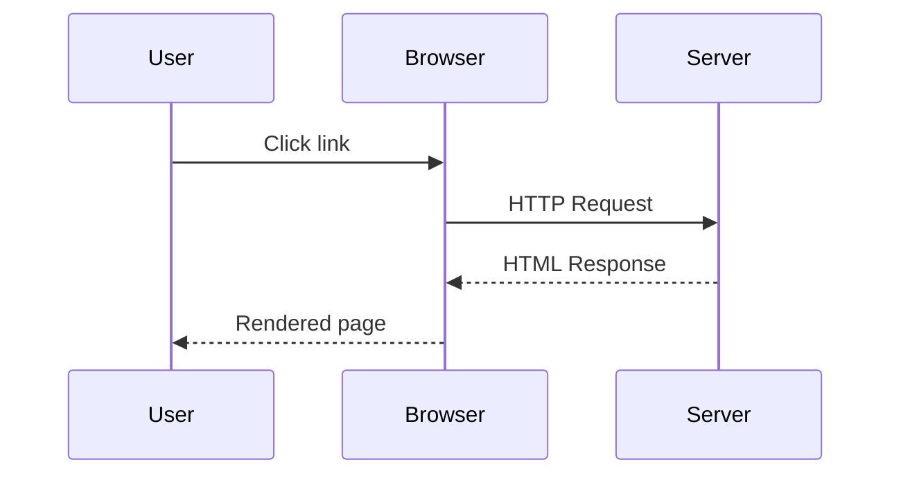

# Markdown Features Guide

Welcome! This guide explains all the enhanced markdown features available for writing blog posts.

## Table of Contents

1. [Syntax Highlighting](#syntax-highlighting)
2. [Image Captions](#image-captions)
3. [Image Galleries & Lightbox](#image-galleries--lightbox)
4. [Mermaid Diagrams](#mermaid-diagrams)
5. [YouTube Video Embedding](#youtube-video-embedding)
6. [Standard Markdown](#standard-markdown)

---

## Syntax Highlighting

Code blocks automatically get syntax highlighting. Just specify the language after the opening `` ``` ``.

### Supported Languages

- `javascript` - JavaScript/Node.js
- `typescript` - TypeScript
- `python` - Python
- `bash` / `shell` - Bash/Shell scripts
- `json` - JSON data
- `html` - HTML markup
- `css` - CSS stylesheets
- `sql` - SQL queries
- `java` - Java code
- `cpp` / `c++` - C++ code
- And many more...

### Example

````markdown
```javascript
function hello(name) {
  console.log(`Hello, ${name}!`);
}

hello("World");
```
````

This will render with syntax highlighting automatically applied.

---

## Image Captions

Add captions to images by including the caption text in quotes after the image URL.

### Syntax

```markdown

```

### Example

```markdown

```

### How It Works

- The text in **quotes** becomes the caption
- The alt text appears if the image fails to load
- Images with captions are wrapped in a semantic `<figure>` element
- Captions appear below the image in italicized gray text

---

## Image Galleries & Lightbox

Click any image to open an interactive lightbox viewer. You can navigate through all images in a post.

### Features

- **Click to Open**: Click any image to open the lightbox
- **Navigation**: Use arrow keys or on-screen buttons to navigate
- **Fullscreen**: Available fullscreen mode (click the fullscreen icon)
- **Zoom**: Zoom in/out on images (use pinch on mobile)
- **Close**: Press ESC or click the close button

### Example Setup

To create a gallery, simply add multiple images with captions:

```markdown


```

Click any image to browse the entire gallery!

---

## Mermaid Diagrams

Create diagrams and flowcharts directly in your markdown using Mermaid syntax.

### Supported Diagram Types

- **Flowchart** - Decision trees and process flows
- **Sequence Diagram** - Interaction between entities
- **Class Diagram** - Object-oriented structures
- **State Diagram** - State machines
- **Entity Relationship** - Database schemas
- **Gantt Chart** - Project timelines
- And more...

### Flowchart Example

````markdown

````

### Sequence Diagram Example

````markdown

````

### Tips

- Mermaid diagrams are lazy-loaded (only load when needed)
- They render as responsive SVG graphics
- Diagrams automatically scale on mobile devices
- See [Mermaid Documentation](https://mermaid.js.org/) for full syntax reference

---

## YouTube Video Embedding

Embed YouTube videos by placing the URL on its own line in your markdown.

### Syntax

Simply paste the YouTube URL on a line by itself:

```markdown
https://www.youtube.com/watch?v=VIDEO_ID
```

Or use the short format:

```markdown
https://youtu.be/VIDEO_ID
```

### How It Works

- The URL must be **on its own line** (in its own paragraph)
- Supported formats:
  - `youtube.com/watch?v=XXX`
  - `youtu.be/XXX`
- Videos use **lazy loading**: The thumbnail shows first, and the iframe only loads when clicked
- This improves page performance and reduces data usage

### Example

```markdown
# Video Demo

Check out this great tutorial:

https://www.youtube.com/watch?v=dQw4w9WgXcQ

It's really helpful!
```

### Tips

- Make sure the URL is on its own line
- No other text should be on the same line as the URL
- Works with both full and shortened YouTube URLs
- Mobile-friendly with tap-to-play

---

## Standard Markdown

All standard markdown features are fully supported:

### Headings

```markdown
# Heading 1
## Heading 2
### Heading 3
#### Heading 4
##### Heading 5
###### Heading 6
```

### Emphasis

```markdown
**bold text**
*italic text*
***bold italic***
~~strikethrough~~
```

### Lists

#### Unordered

```markdown
- Item 1
- Item 2
  - Nested item 2a
  - Nested item 2b
- Item 3
```

#### Ordered

```markdown
1. First item
2. Second item
   1. Nested item 2a
   2. Nested item 2b
3. Third item
```

### Links

```markdown
[Link text](https://example.com)
[Link with title](https://example.com "Optional title")
```

### Inline Code

```markdown
Use `const` for constant variables in JavaScript.
```

### Code Blocks

````markdown
```
Plain code block without syntax highlighting
```
````

### Blockquotes

```markdown
> This is a blockquote
> It can span multiple lines
> And contain **formatted text**
```

### Tables

```markdown
| Header 1 | Header 2 | Header 3 |
|----------|----------|----------|
| Cell 1   | Cell 2   | Cell 3   |
| Cell 4   | Cell 5   | Cell 6   |
```

### Horizontal Rule

```markdown
---
```

---

## Best Practices

1. **Use Meaningful Alt Text**: Always provide descriptive alt text for images
2. **Add Captions When Helpful**: Captions improve understanding and SEO
3. **Keep Code Blocks Short**: Long code examples are harder to read; break them into smaller chunks
4. **Use Diagrams Wisely**: Diagrams are great for processes, but use them selectively
5. **Test Embedded Videos**: Always verify videos are public and accessible
6. **Structure with Headings**: Use heading hierarchy (h1, h2, h3) for organization
7. **Check Your Links**: Ensure external links are current and working

---

## Troubleshooting

### Images Not Showing

- Check that the image path is correct (relative to public folder)
- Ensure the image file exists
- Try using absolute URLs for external images

### Code Highlighting Not Working

- Make sure you specified the language: `` ```javascript `` (not just ``` )
- Check that the language name is correct
- Some languages may not be supported; use the closest alternative

### Mermaid Diagrams Not Rendering

- Check syntax against [Mermaid documentation](https://mermaid.js.org/)
- Make sure you used `` ```mermaid `` (not `` ```diagram `` )
- Complex diagrams may fail; simplify if needed

### YouTube Videos Not Embedding

- Ensure the URL is on its own line (in its own paragraph)
- Check that the URL is a valid YouTube link
- Verify the video is public and not restricted

---

## Example Blog Post

See `markdown-features-demo.md` for a complete working example that demonstrates all features!

---

## Questions or Issues?

If you encounter any problems with markdown rendering, please check:

1. The syntax is correct according to this guide
2. The file is saved with `.md` extension
3. The post is enabled in `content.config.json`
4. The development server has reloaded (check console)

For more information, see the [Markdown guide documentation](https://www.markdownguide.org/).
