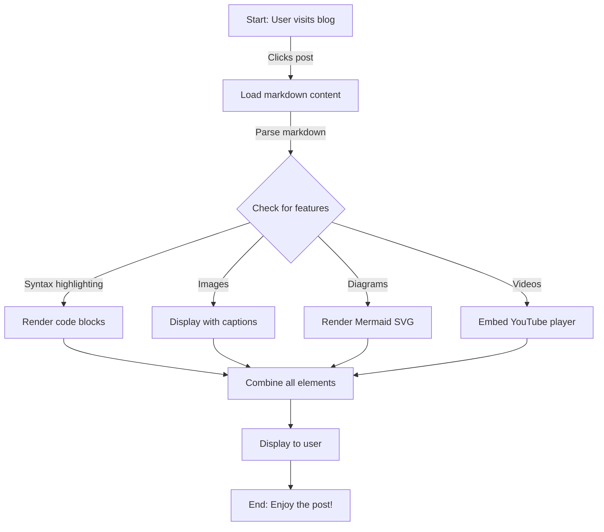
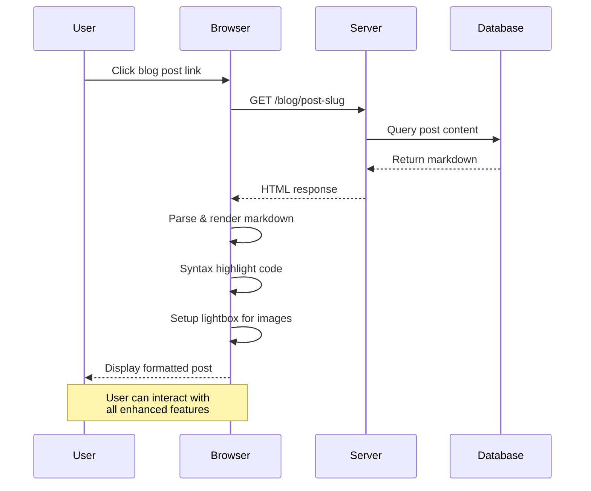

# Complete Guide to Our Enhanced Markdown Features

This interactive demo post showcases every enhanced markdown feature available on our blog. Use this as a reference when creating your own posts, or click through to experience all the features firsthand!

## Quick Navigation

- [Syntax Highlighting](#syntax-highlighting)
- [Code Examples](#code-examples)
- [Image Captions](#image-captions-and-lightbox-gallery)
- [Diagrams](#diagrams-with-mermaid)
- [Videos](#youtube-video-embedding)
- [Markdown Basics](#tables)

---

## Syntax Highlighting

All code blocks automatically get beautiful syntax highlighting. The code is color-coded based on the language you specify, making it easier to read and understand.

### Code Examples

**JavaScript** - Functions and logic:

```javascript
// Modern JavaScript with async/await
async function fetchUserData(userId) {
  try {
    const response = await fetch(`/api/users/${userId}`);
    if (!response.ok) {
      throw new Error(`HTTP error! status: ${response.status}`);
    }
    const userData = await response.json();
    console.log('User data:', userData);
    return userData;
  } catch (error) {
    console.error('Failed to fetch user:', error);
    return null;
  }
}

// Fibonacci sequence using recursion
function fibonacci(n) {
  if (n <= 1) return n;
  return fibonacci(n - 1) + fibonacci(n - 2);
}

const fib10 = fibonacci(10); // Returns: 55
```

**TypeScript** - Type-safe code:

```typescript
// TypeScript interfaces and generics
interface User {
  id: number;
  name: string;
  email: string;
  isActive: boolean;
  createdAt: Date;
}

interface ApiResponse<T> {
  success: boolean;
  data: T;
  error?: string;
}

async function createUser(user: User): Promise<ApiResponse<User>> {
  try {
    const response = await fetch('/api/users', {
      method: 'POST',
      headers: { 'Content-Type': 'application/json' },
      body: JSON.stringify(user),
    });
    return await response.json();
  } catch (error) {
    return { success: false, error: String(error) };
  }
}
```

### Python

```python
import numpy as np
from collections import defaultdict

def count_elements(arr):
    """
    Count occurrences of each element in array
    """
    counts = defaultdict(int)
    for element in arr:
        counts[element] += 1
    return dict(counts)

data = [1, 2, 2, 3, 3, 3, 4, 4, 4, 4]
result = count_elements(data)
print(result)  # Output: {1: 1, 2: 2, 3: 3, 4: 4}
```

### Bash

```bash
#!/bin/bash

# Function to backup files
backup_files() {
  local source=$1
  local destination=$2

  if [ ! -d "$destination" ]; then
    mkdir -p "$destination"
  fi

  cp -r "$source"/* "$destination/"
  echo "Backup completed: $(date)"
}

# Run backup
backup_files "./documents" "./backups"
```

### JSON

```json
{
  "name": "My Project",
  "version": "1.0.0",
  "description": "A sample JSON configuration",
  "dependencies": {
    "react": "^19.0.0",
    "typescript": "^5.0.0",
    "tailwindcss": "^3.4.0"
  },
  "scripts": {
    "build": "npm run build",
    "dev": "npm run dev",
    "test": "npm test"
  }
}
```

## Image Captions and Lightbox Gallery

Images can now have captions, and clicking them opens an interactive lightbox viewer. All images in a post become a browsable gallery!

### Test Case: Image with Caption


**Try this:** Click the image above to open the lightbox. You can:
- Navigate with arrow keys or on-screen buttons
- View in fullscreen mode
- Zoom in/out on the image
- Press ESC to close

### Gallery: Multiple Images

Add multiple captioned images to create an interactive gallery:


**Pro tip:** Click any image in the gallery above to browse through all three images using the navigation controls!

## Diagrams with Mermaid

Create beautiful, responsive diagrams directly in your markdown. Mermaid diagrams render as clean SVG graphics that scale on all devices.

### Test Case 1: Flowchart



The flowchart above shows the blog rendering process. Mermaid automatically handles layout and styling!

### Test Case 2: Sequence Diagram

Show interactions and communication flows between different entities:



## YouTube Video Embedding

Embed YouTube videos by placing the video URL on its own line. Videos use **lazy loading** - the thumbnail displays first, and the iframe only loads when you click play.

### Test Case 1: Full URL Format

https://www.youtube.com/watch?v=dQw4w9WgXcQ

The video above uses the full YouTube URL format. Click the thumbnail to play!

### Test Case 2: Short URL Format

https://youtu.be/dQw4w9WgXcQ

Both formats work identically. Choose whichever you prefer!

## Tables

Here's an example table with structured data:

| Feature | Syntax | Example |
|---------|--------|---------|
| Syntax Highlighting | ` ```language ` | ` ```javascript ` |
| Image Caption | `` | `` |
| Mermaid Diagram | ` ```mermaid ` | Flowchart, Sequence, etc. |
| YouTube Embed | URL on own line | `https://youtube.com/watch?v=...` |
| Lists | `-` or `1.` | Both ordered & unordered |

## Lists and Blockquotes

### Unordered List

- Feature one: Syntax highlighting for code blocks
- Feature two: Image captions with lightbox gallery
- Feature three: Mermaid diagram support
- Feature four: YouTube auto-embedding
- Feature five: Responsive, mobile-friendly design

### Ordered List

1. Write markdown with the new syntax
2. Save the blog post to the content folder
3. The blog automatically picks it up
4. Features render beautifully
5. Share your enhanced posts!

### Blockquote

> The best writing is clear, concise, and meaningful. With enhanced markdown, you can create rich, engaging blog posts that combine text, code, images, and diagrams in a cohesive narrative.
>
> — Blog Philosophy

## Nested Lists

- Main feature
  - Sub-feature 1
    - Detail about sub-feature 1
  - Sub-feature 2
    - Detail about sub-feature 2
- Another main feature
  1. First step
  2. Second step
  3. Third step

## Inline Code and Formatting

You can use inline code like `const myVariable = true;` within your text. You can also use **bold text**, *italic text*, ***bold italic***, and ~~strikethrough~~ formatting.

Code highlighting works for inline code too: `Array.map()`, `React.useState()`, `const`, `function`.

## Horizontal Rule

---

## Testing Checklist

Use this post to test all features:

**✅ Syntax Highlighting**
- [ ] JavaScript code displays with color syntax
- [ ] TypeScript code displays with type annotations highlighted
- [ ] Python, Bash, JSON also render correctly

**✅ Image Features**
- [ ] Click images to open lightbox
- [ ] Captions display below images
- [ ] Navigate between gallery images with arrows
- [ ] Fullscreen mode works
- [ ] Zoom controls function properly

**✅ Diagrams**
- [ ] Flowchart renders and is responsive
- [ ] Sequence diagram shows all participants
- [ ] Diagrams scale on mobile devices

**✅ Video Embedding**
- [ ] Both YouTube URL formats display thumbnails
- [ ] Videos load when clicked (not immediately)
- [ ] Responsive 16:9 aspect ratio maintained

**✅ Standard Markdown**
- [ ] Tables render with borders
- [ ] Lists format correctly
- [ ] Blockquotes have left border
- [ ] Links underline on hover

---

## Conclusion

This demo post showcases all the enhanced markdown features now available:

- ✅ Syntax highlighting with multiple language support
- ✅ Image captions and interactive lightbox galleries
- ✅ Beautiful, responsive Mermaid diagrams
- ✅ Lazy-loaded YouTube video embedding
- ✅ All standard markdown features (lists, tables, blockquotes, etc.)

Start using these features in your blog posts to create richer, more engaging content!

---

**Quick Reference:**
- Click images to open lightbox
- Paste YouTube URLs on their own line to embed videos
- Use ` ```mermaid ` blocks for diagrams
- Specify language for code highlighting (` ```javascript `, ` ```python `, etc.)
- Add image captions with quotes: ``
